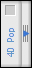
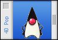

# 4DPop

This component installs a palette in the Design mode.    
Tools will be added to this palette gradually as compatible components are installed.

##Installation

Put the `4Dpop.4dbase` (or an alias) into the "`Components`" folder of the 4D application or of a database.

To activate 4DPop into a database, just activate the database preference `Execute "On Host Database Event" method of the components` then restart your database. The palette should be displayed in the lower left corner of the screen in Design mode.




## Use
If the palette is closed you can open it by pulling the handle.    
If you double-click on the handle of the palette when closed, it will open and adjust its size to the number of tools present. Double-clicking on the handle of the open palette will close it.

If no compatible component is installed, the opened palette will display the following picture:



If one or more components are installed, they will appear as buttons.


* Clicking on one of these buttons can either launch the corresponding tool or open a menu that can be used to select from a collection of tools.
* Clicking while holding down the Option key on Macintosh or the Alt key on Windows will open the help file associated with the component ("MyComponent.htm" file placed next to the structure file of the component).

You can move the palette by clicking on the title bar, place it on left or on the right of the screen. The palette's position is memorized.

A contextual menu is accessible on the title bar of the palette. It takes again the whole of the tools charged and some options with display of the palette.

You can install a new compatible component in the palette by dropping it. After confirmation, an alias of the base is created in the "Components" folder and the database re-opened.


The 4DPop help is available in the help menu.

## Compatible components

The tools that you can integrate into 4DPop are interpreted or compiled components; therefore they comply with the development rules of components (see the documentation).

The integration of a component into the 4DPop palette is based on the presence of a "4DPop.xml" file in the "Resources" folder of the component database. This file describes the component elements that will be available using keys and their attributes.

```xml
<?xml version="1.0" encoding="UTF-8" standalone="no" ?>
<tools name="My tool" picture="Ruler.png" helptip="Help you" initProc="Init">
   <tool name="Rulers" method="4DPop_ScreenRuler"/>
</tools>
```

Tag        | Description
----       | ----
`<tools>`  | Start of file
`<tool>`   | Start tool definition
`</tool>`  | End tool definition
`</tools>` | End

###'tools' element

The attributes for `tools` element are:

* **name**: Name* as it will be displayed below the button (mandatory).
* **picture**: Name of the picture file of the button. This file must be located at the root of the "Resources" folder of the component (optionally, if omitted a default picture is used).
* **helptip**: Text* of help tip associated with button.
* **initproc**: Name** of the component method to be executed on loading.
* **ondrop**: Name** of the component method to be executed at the time of a drop on the button.
* **default**: Name** of the component method to be executed for a simple clic on the button when more than one tool is available.
* **popup**: Display flag of the pop-up arrow linked with the button . Values: "True" (to display the arrow even when there is only one <tool> tag, see below)

###'tool' element

This tag can be repeated: if there is only one <tool> tag, the method is executed as soon as the button is clicked; if there are several <tool> tags, a menu arrow linked with the button is displayed and a menu listing the available tools is provided for the user. In case of the default attribute above is defined, a simple clic launches the method referenced and a long click or an on arrow click display the tools' menu.

The attributes for `tool` element are:

* **name**: Name* of the tool as it will appear in the menu associated with the button (mandatory if there are several <tool> tags)
* **method**: Name** of the component method corresponding to the tool to be executed (mandatory)
* **picture**: Name of the picture file associated with the menu item. This file must be located in the "Resources" folder of the component.

_Note_: The component method can be responsible for building and displaying the menu. In this case, a single <tool> tag calls the component method whose code displays the menu and processes the choice of the user. In order for the related menu arrow to be displayed on the button of your tool, you must pass "True" in the popup attribute of the <tools> tag.

\* Accepts the ":xliff :resname" syntax, therefore the strings must be located in the xliff files of the component. The displayed string will be localized.

\** The methods must have been declared as shared in the component database.
All these methods receive a pointer as parameter (on the button of the palette. this pointer can be used to test the state of the button or to correctly display a popup). If you plan to compile the component, this parameter must be declared explicitly [C_POINTER($1)] in all the methods of the component called by 4DPop (initproc, ondrop, default, and method) if not, an error will be generated each time the method is called (-20008 - incorrect Parameters in a command EXECUTER).
