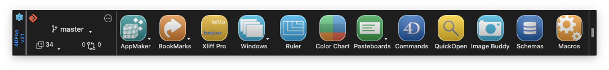

<!-- MARKDOWN LINKS & IMAGES -->
[code-shield]: https://img.shields.io/static/v1?label=language&message=4d&color=blue
[code-url]: https://developer.4d.com/
[componentManager]: https://img.shields.io/badge/Compatible-manager?logo=4d&label=Project%20Dependencies&color=blue&link=https%3A%2F%2Fdeveloper.4d.com%2Fdocs%2FProject%2Fcomponents%2F%23loading-components

[code-top]: https://img.shields.io/github/languages/top/vdelachaux/4DPop.svg
[code-size]: https://img.shields.io/github/languages/code-size/vdelachaux/4DPop.svg

[release-shield]: https://img.shields.io/github/v/release/vdelachaux/4DPop?include_prereleases
[release-url]: https://github.com/vdelachaux/4DPop/releases/latest

[license-shield]: https://img.shields.io/github/license/vdelachaux/4DPop
[license-url]: LICENSE

[build-shield]: https://github.com/vdelachaux/4DPop/actions/workflows/build.yml/badge.svg
[build-url]: https://github.com/vdelachaux/4DPop/actions/workflows/build.yml

[notarized]: https://img.shields.io/badge/notarized-blue

[![language][code-shield]][code-url]
[![language-top][code-top]][code-url]
![code-size][code-size]
![componentManager][componentManager]
 
[![license][license-shield]][license-url]
 
[![release][release-shield]][release-url]
[![build][build-shield]][build-url]

# <a name="overview">Overview</a>

`4DPop` is a series of productivity components grouped into a toolbar that integrates perfectly with the 4D development environment. 

[4D TN Spotlight](https://vimeo.com/3750045)

`4DPop.4dbase` is the container component that handles loading and provides an interface to compatible components.

Filled with clever tools and immediately useful for developers, `4DPop` has many advantages:

#### _A Mind for Productivity_
Every `4DPop` component is a handy little nugget you’ll wonder how you ever did without. Created by 4D developers for 4D developers, they’ll help you save precious time on repetitive operations, be the little helpers you always dreamt of having, and put an even friendlier face on your development environment.

#### _Easy to Use_
Installing a new component is easy: Just drag and drop on to the 4DPop toolbar! Each comes with its own online help.

#### _Modular_
You can compose your `4DPop` palette à la carte with the tools you prefer, without overloading your screen. 

#### _Free_
`4DPop` and its components are free to use and distribute in all 4D development environments.

#### _Source Code Provided_
Like all 4D components, `4DPop` tools are miniature 4D projects delivered to you compiled for your immediate use, but also in interpreted mode, so that you can explore the source code. You may wonder how rules are created in `4DPop Rulers`, for example, or how `4DPop Commands` manages predictive typing, or how to manage a palette, a help file or to create a component. It’s all there in the code. 4DPop’s code is also a very good example of the art of programming efficiently in 4D... even if we do say so ourselves!

#### _Open_
You can enhance `4DPop` with [your own components](#how-to), and you are also able to share them, and [find others in the 4D developer community](https://github.com/topics/4dpop).

📥 [Get the latest version of the all-in-one family ](https://github.com/vdelachaux/4DPop-Family/releases/latest) or explore the family and add only the components you want from the list below.

| Repository| Last release | Build status | macOS |
|:------:|--------------|--------------|:---:|
|[**4DPop**](https://github.com/vdelachaux/4DPop)|[![release][release-shield]][release-url]|[![build][build-shield]][license-url]|![notarized][notarized]
|[**AppMaker**](https://github.com/vdelachaux/4DPop-AppMaker)|||![notarized][notarized]
|[**Bookmarks**](https://github.com/vdelachaux/4DPop-Bookmarks) |||![notarized][notarized]
|[**ColorChart**](https://github.com/vdelachaux/4DPop-ColorChart) |||![notarized][notarized]
|[**Commands**](https://github.com/vdelachaux/4DPop-Commands) |||![notarized][notarized]
|[**Constants-Editor**](https://github.com/vdelachaux/4DPop-Constants-Editor)|||![notarized][notarized]
|[**Git**](https://vdelachaux.github.io/4DPop-Git/) |||![notarized][notarized]
|[**Image-Buddy**](https://github.com/vdelachaux/4DPop-Image-Buddy)|||![notarized][notarized]
|[**KeepIt**](https://github.com/vdelachaux/4DPop-KeepIt) |||![notarized][notarized]
|[**Macros**](https://github.com/vdelachaux/4DPop-Macros)|||![notarized][notarized]
|[**Pasteboard**](https://github.com/vdelachaux/4DPop-Pasteboard) |||![notarized][notarized]
|[**QuickOpen**](https://github.com/vdelachaux/4DPop-QuickOpen) |||![notarized][notarized]
|[**Rulers**](https://github.com/vdelachaux/4DPop-Rulers) |||![notarized][notarized]
|[**sqlSchemas**](https://github.com/vdelachaux/4DPop-sqlSchemas) |||![notarized][notarized]
|[**Window**](https://github.com/vdelachaux/4DPop-Window) |||![notarized][notarized]
|[**XLIFF-Pro**](https://vdelachaux.github.io/4DPop-XLIFF-Pro) |||![notarized][notarized]

>  📌 Click on a component name in the "Repository" column above to access its repository, where the source code is available.
>     
>  📌 Click on the `Release` tag of each component above to access its latest revision.

And when you’re ready to deploy, you can eliminate all the `4DPop` elements from your app to ensure its light weight.

# <a name="installation">Installation</a>

1. Create a `Components` folder next to the `Project` folder of your database \*.
2. Place the `4DPop.4dbase` component \** in the `Components` folder.
3. Place one or more `4DPop components` you want to use in the same folder. 
3. Open your database.
4. Open the structure settings dialog and go to the `Security` page to activate, if any, the option `Execute "On Host Database Event" Method of the component`
5. Reopen the database, the palette is displayed in the lower left corner of the screen in Design mode.

	\* For a binary database, the `Components` folder must be located next to the structure file of your database (".4db").    
	\** On `macOS`, the component is a package whose ".4dbase" extension is not necessarily visible depending on your display preference settings.

>📍It is always preferable to use an alias file (macOS) or shortcut file (Windows) instead of the component and thus store the originals in a single copy. Updates will be simplified especially if you maintain several projects. 

# <a name="compatible-components">Compatible Components</a>

Some developers provide tools that are displayed in the 4DPop palette. You can access the [list of compatible components](https://github.com/topics/4dpop) referenced on Github (with the `4dpop` topic). 

Here are the ones I know:    

| | | | | |
|:----:|:----:|:----:|:----:|:----:|
|[**4D SVG**\*](https://doc.4d.com/4Dv18/4D/18/4D-SVG-Component.100-4611717.en.html)|[**4D JSON Validator**](https://github.com/AdrienCagniant/4DPop-JSON-Validator)|[**chromo4D**](https://forums.4d.com/Post/EN/1576084/1/1576085#1576085)|[**RegexLab**](https://github.com/AJARProject/AJ_Tools_Regex)|[**Math4D**](https://forums.4d.com/Post/EN/31847250/1/31847251#31847251)|
|[**ogResources Buddy**](https://www.protee.org/index.php/en/download-en/4d-free-bonus)|[**QS_Toolbox**](https://association-qualisoft.eu/qs_toolbox-description/)|

\*Included into the 4D application

# ~~<a name="how-to">How to make a component compatible with 4DPop?</a>~~

~~The compatibility of a component with the 4DPop palette is based on the presence of a "4DPop.xml" file in its "Resources" folder.~~ 

~~This XMLfile describes the elements of the component that will be available with keys and their attributes.~~

~~Something like:~~

~~`<?xml version="1.0" encoding="UTF-8" standalone="no" ?>`~~    

~~`<tools name=":xliff:Ruler" picture="Ruler.png" helptip=":xliff:ToolHelpTip" initProc="Init">`~~

~~` <tool name="Rulers" method="4DPop_ScreenRuler"/>`~~

~~`</tools>`~~

## ~~Keys~~

### ~~\<tools>~~
~~Start and end of file. Mandatory~~

#### ~~Attributes~~
* ~~**name**: Name as it will be displayed below the button ① (mandatory).~~
* ~~**picture**: Name of the picture file of the button. This file must be located at the root of the "Resources" folder of the component (optionally, if omitted a default picture is used).~~
* ~~**helptip**: Text of help tip associated with button ①~~
* ~~**initproc**: Name of the component method ② to be executed on loading.~~ 
* ~~**ondrop**: Name of the component method ② to be executed at the time of a drop on the button.~~ 
* ~~**default**: Name of the component method ② to be executed for a simple clic on the button when more than one tool is available.~~
* ~~**popup**: Display flag of the pop-up arrow linked with the button . Values: "True" (to display the arrow even when there is only one <tool> key, see below)~~

### ~~\<tool>~~
~~Start and end of definition of a tool.~~

~~This key can be repeated: ~~

* ~~if there is only one <tool> key, the method is executed as soon as the button is clicked;~~ 
* ~~if there are several <tool> keys, a menu arrow linked with the button is displayed and a menu listing the available tools is provided for the user. ~~

~~In case of the default attribute above is defined, a simple clic launches the method referenced and a long click or an on arrow click display the tools' menu.~~

#### ~~Attributes~~
* ~~**name**: Name of the tool as it will appear in the menu associated with the button ① (mandatory if there are several <tool> keys)~~
* ~~**method**: Name of the component method ② corresponding to the tool to be executed (mandatory)~~

~~① These attributes accept the syntax ":xliff :resname", so the strings must be located in the xliff files of the components and the displayed string will be localized.

~~② The called methods must have been declared as shared in the component database. All the methods receive a pointer as parameter (on the button of the palette. this pointer can be used to test the state of the button or to correctly display a popup). If you plan to compile the component, this parameter must be declared explicitly [var $1 : Pointer] in all the methods of the component called by 4DPop (initproc, ondrop, default, and method) if not, an error will be generated each time the method is called (-20008 - incorrect Parameters in a command EXECUTER).~~

> 📍~~The component method can be responsible for building and displaying the menu. In this case, a single <tool> tag calls the component method whose code displays the menu and processes the choice of the user. In order for the related menu arrow to be displayed on the button of your tool, you must pass "True" in the popup attribute of the <tools> key.~~

**It will be very appreciated if you publish your component on Github and don't forget to [link your project with the 4DPop topic](#topic).**

# <a name="topic">Topic 4DPop</a>
If you develop a [component compatible with 4DPop](#how-to), it is strongly recommended to add the "4DPop" [topic](https://docs.github.com/en/github/administering-a-repository/managing-repository-settings/classifying-your-repository-with-topics) to be referenced in the [list of 4DPop compatible components](https://github.com/topics/4dpop).

# Note
If you encountered a bug or have a feature request, feel free to create an issue.
However, it is highly appreciated if you <a href="https://github.com/vdelachaux/4DPop/issues" target="_blank">browse and search current issues</a> first.
Found the issue? Go on and join its discussion thread.
Not found? Go on and <a href="https://github.com/vdelachaux/4DPop/issues/new" target="_blank">create one</a>.
