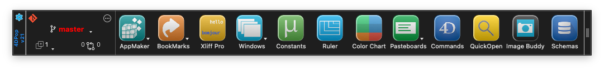

# 4DPop

4DPop is the container component that handles loading and provides an interface to compatible components.

All others component of the 4DPop family are independent tools that you can install or not.

# 4DPop family

* [4DPop **AppMaker**](https://github.com/vdelachaux/4DPop-AppMaker)
* [4DPop **Bookmarks**](https://github.com/vdelachaux/4DPop-Bookmarks)
* [4DPop **Color Chart**](https://github.com/vdelachaux/4DPop-ColorChart)
* [4DPop **Commands**](https://github.com/vdelachaux/4DPop-Commands)
* [4DPop **Constants Editor**](https://github.com/vdelachaux/4DPop-Constants-Editor)
* [4DPop **Git**](https://vdelachaux.github.io/4DPop-Git/)
* 4DPop **Image buddy**
* 4DPop **KeepIt**
* [4DPop **Macros**](https://github.com/vdelachaux/4DPop-Macros)
* 4DPop **Pasteboard**
* 4DPop **Rulers**
* 4DPop **sqlSchemas**
* 4DPop **Window**
* 4DPop **XLIFF** - Edit XLIFF files to localize your database
* [4DPop **XLIFF Pro**](https://vdelachaux.github.io/4DPop-XLIFF-Pro/)

# Compatible Components

* [**4D SVG**](https://doc.4d.com/4Dv18/4D/18/4D-SVG-Component.100-4611717.en.html)
* [**4D JSON Validator**](https://blog.4d.com/a-new-tool-json-validator/)
* [**chromo4D**](https://forums.4d.com/Post/EN/1576084/1/1576085#1576085)
* [**Math4D**](https://forums.4d.com/Post/EN/31847250/1/31847251#31847251)
